<!-- Portrait ASCII (Tux) qui se tape ligne par ligne, a cote d'une carte
     neofetch. Regenerer l'art : python scripts/generate_art.py -->

<!-- Graphe de contributions anime (vraies donnees, cases qui s'allument une
     a une), regenere chaque jour par .github/workflows/update-profile-art.yml -->

 
 

<table>
<tr>
<td valign="top"></td>
<td valign="top"></td>
</tr>
</table>

 
 

<b>Developer · Discord Bots · FiveM · Web — Paris, France</b>

 

